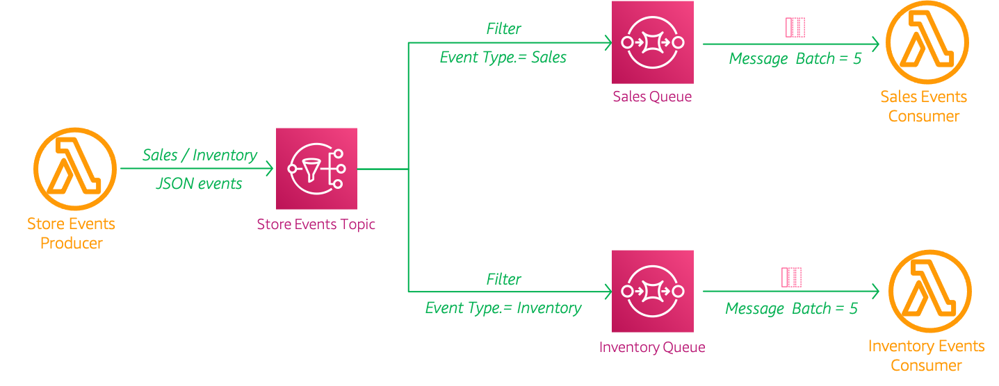
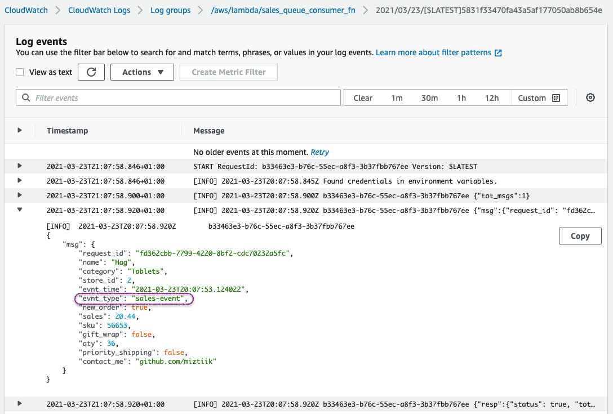
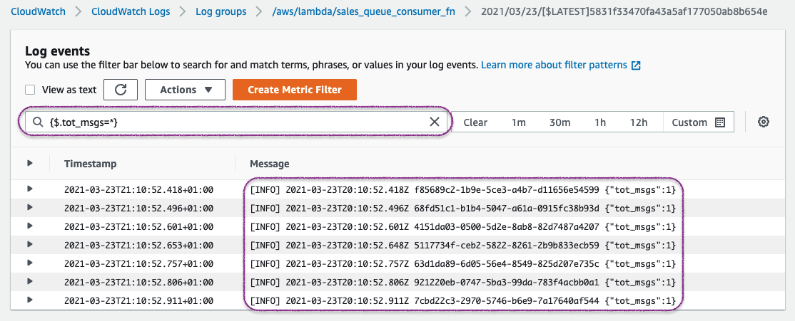
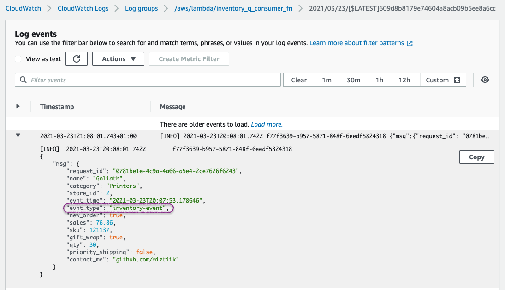

# Event Driven Architecture with SNS, SQS & Lambda

The developer at Mystique Unicorn are interested in building their application using event-driven architecture. For those who are unfamiliar, _An event-driven architecture uses events to trigger and communicate between decoupled services and is common in modern applications built with microservices. An event is a change in state, or an update, like an item being placed in a shopping cart on an e-commerce website._

In this application, they will have their physical stores, send _sales_ and _inventory_ related events to a central location, where multiple downstream systems will consume these events. For example, A event for a new order will be consumed by the warehouse system and an event regarding inventory will be consume by stock keeping systems. 

Can you help route the incoming events to appropriate destinations?


## 🎯 Solutions

AWS offer multiple ways to route messages: SNS, EventBridge, Managed Kafka etc., In this solution we will see how to use SNS for our needs.

By default, an Amazon SNS topic subscriber receives every message published to the topic. To receive a subset of the messages(in our case `sales_event`), a subscriber must assign a filter policy to the topic subscription. A filter policy is a simple JSON object containing attributes that define which messages the subscriber receives.

When you publish a message to a topic, Amazon SNS compares the message attributes to the attributes in the filter policy for each of the topic’s subscriptions. If any of the attributes match, Amazon SNS sends the message to the subscriber. Otherwise, Amazon SNS skips the subscriber without sending the message.

You can simplify your use of Amazon SNS by consolidating your message filtering criteria into your topic subscriptions. This allows you to offload the message filtering logic from subscribers and the message routing logic from publishers, eliminating the need to filter messages by creating a separate topic for each condition. You can use a single topic, differentiating your messages using attributes. Each subscriber receives and processes only the messages accepted by its filter policy.



In this demo, we will create a the architecture like the one shown above. We will create a new SQS queue for `sales_events`, and create a subscription to the `store_events` topic SNS topic with a filter policy to route each message to the `sales_events` SQS queue. To indicate `sales_events`, you will assign an attribute, location, with a value `sales-event` to the message. We repeat the same exercise for `inventory_events` as well.

The incoming events will look like this,
```json
{
  "data": {
    "request_id": "751cb7ed-27ad-4bd5-b3e2-1bd3ba0f8458",
    "name": "Aasimar",
    "category": "Shoes",
    "store_id": 1,
    "evnt_time": "2021-03-23T19:41:56.463421",
    "evnt_type": "inventory-event",
    "new_order": true,
    "sales": 56.33,
    "sku": 44324,
    "gift_wrap": false,
    "qty": 14,
    "priority_shipping": true,
    "contact_me": "github.com/miztiik"
  }
}
```


1.  ## 🧰 Prerequisites

    This demo, instructions, scripts and cloudformation template is designed to be run in `us-east-1`. With few modifications you can try it out in other regions as well(_Not covered here_).

    - 🛠 AWS CLI Installed & Configured - [Get help here](https://youtu.be/TPyyfmQte0U)
    - 🛠 AWS CDK Installed & Configured - [Get help here](https://www.youtube.com/watch?v=MKwxpszw0Rc)
    - 🛠 Python Packages, _Change the below commands to suit your OS, the following is written for amzn linux 2_
      - Python3 - `yum install -y python3`
      - Python Pip - `yum install -y python-pip`
      - Virtualenv - `pip3 install virtualenv`

1.  ## ⚙️ Setting up the environment

    - Get the application code

      ```bash
      git clone https://github.com/miztiik/message-filtering-with-sns
      cd message-filtering-with-sns
      ```

1.  ## 🚀 Prepare the dev environment to run AWS CDK

    We will use `cdk` to make our deployments easier. Lets go ahead and install the necessary components.

    ```bash
    # You should have npm pre-installed
    # If you DONT have cdk installed
    npm install -g aws-cdk

    # Make sure you in root directory
    python3 -m venv .venv
    source .venv/bin/activate
    pip3 install -r requirements.txt
    ```

    The very first time you deploy an AWS CDK app into an environment _(account/region)_, you’ll need to install a `bootstrap stack`, Otherwise just go ahead and deploy using `cdk deploy`.

    ```bash
    cdk bootstrap
    cdk ls
    # Follow on screen prompts
    ```

    You should see an output of the available stacks,

    ```bash
    message-filtering-with-sns-producer-stack
    message-filtering-with-sns-sales-consumer-stack
    message-filtering-with-sns-inventory-consumer-stack
    ```

1.  ## 🚀 Deploying the application

    Let us walk through each of the stacks,

    - **Stack: message-filtering-with-sns-producer-stack**

      This stack will create a store events producer sns topic and use a lambda function to generate the events and ingest them to SNS. The producer will add this message attributes `evnt_type` with either a value of `sales-event` or `inventory_event`. We will later use these values to filter the messages.

      Initiate the deployment with the following command,

      ```bash
      cdk deploy message-filtering-with-sns-producer-stack
      ```

      After successfully deploying the stack, Check the `Outputs` section of the stack. You will find the `StoreOrdersEventsProducer` producer lambda function. We will invoke this function later during our testing phase.

    - **Stack: message-filtering-with-sns-sales-consumer-stack**

      This stack will create a SQS to subscribe to the sales events from SNS. Although we can invoke our consumer lambda directly to SNS, the addition of SQS inline allows us to avoid back pressure if there are spikes in our events. It also allows us to batch messages before invoking our consumer. While adding the subscription to our SNS topic, we will add the subscription filter<sup>[1]</sup> which would look like this,
      ```json
      {
        "evnt_type": [ "sales-event" ]
      }
      ```
      The consumer lambda itself is simple, it will just write the event to cloudwatch logs. While subscribing our lambda to the SQS queue, we inform sqs to batch messages with a value of `5`.

      Initiate the deployment with the following command,

      ```bash
      cdk deploy message-filtering-with-sns-sales-consumer-stack
      ```

      After successfully deploying the stack, Check the `Outputs` section of the stack. You will find the `SalesEventsConsumer` resource.

    - **Stack: message-filtering-with-sns-inventory-consumer-stack**

      The only difference in this stack from the previous one is that the filter policy would look like this,

      ```json
      {
        "evnt_type": [ "inventory-event" ]
      }
      ```

      ```bash
      cdk deploy message-filtering-with-sns-inventory-consumer-stack
      ```

      After successfully deploying the stack, Check the `Outputs` section of the stack. You will find the `InventoryEventsConsumer` resource.


1.  ## 🔬 Testing the solution

    1. **Invoke Producer Lambda**:
      Let us start by invoking the lambda `StoreOrdersEventsProducer` from the producer stack using the AWS Console. If you want to ingest more events, invoke the lambda few times.
          ```json
          {
            "statusCode": 200,
            "body": "{
              \"message\": 
                      {
                        \"status\": true, 
                        \"tot_msgs\": 14, 
                        \"bad_msgs\": 3, 
                        \"sales_evnts\": 7, 
                        \"inventory_evnts\": 7, 
                        \"tot_sales\": 782.5
                      }
                }"
          }
          ```
        Here in this invocation, We have ingested about `14` messages. Within those message, we have `5` sale events and `9` inventory events with a total sale value of `692.71`

    1. **Check CloudWatch Logs for Sales Consumer**:

       In Cloudwatch Logs find the logs `/aws/lambda/sales_queue_consumer_fn`. You will find all the events are of type `sales-events`. 
      
       
      
       You can also use filter pattern matching<sup>[2]</sup> to count all the messages that have been received will match the count of message sent by the producer.(_Ofcourse, i did invoke only once, so it was easy to do a simple count in a single log stream_)

       

       Likewise you can also check the logs for inventory consumer `/aws/lambda/inventory_q_consumer_fn`

       

1.  ## 📒 Conclusion

    Here we have demonstrated how to use SNS message filter to route message to appropriate consumer. You can extend this further by adding DLQ to the queue.

1.  ## 🧹 CleanUp

    If you want to destroy all the resources created by the stack, Execute the below command to delete the stack, or _you can delete the stack from console as well_

    - Resources created during [Deploying The Application](#-deploying-the-application)
    - Delete CloudWatch Lambda LogGroups
    - _Any other custom resources, you have created for this demo_

    ```bash
    # Delete from cdk
    cdk destroy

    # Follow any on-screen prompts

    # Delete the CF Stack, If you used cloudformation to deploy the stack.
    aws cloudformation delete-stack \
      --stack-name "MiztiikAutomationStack" \
      --region "${AWS_REGION}"
    ```

    This is not an exhaustive list, please carry out other necessary steps as maybe applicable to your needs.

## 📌 Who is using this

This repository aims to show how to use event driven architectures with message filtering to new developers, Solution Architects & Ops Engineers in AWS. Based on that knowledge these Udemy [course #1][102], [course #2][101] helps you build complete architecture in AWS.

### 💡 Help/Suggestions or 🐛 Bugs

Thank you for your interest in contributing to our project. Whether it is a bug report, new feature, correction, or additional documentation or solutions, we greatly value feedback and contributions from our community. [Start here](/issues)

### 👋 Buy me a coffee

[](https://ko-fi.com/Q5Q41QDGK) Buy me a [coffee ☕][900].

### 📚 References

1. [Docs: Amazon SNS subscription filter policies][1]
1. [Docs: Amazon Cloudwatch - Filter and Pattern Syntax][2]


### 🏷️ Metadata


**Level**: 200

[1]: https://docs.aws.amazon.com/sns/latest/dg/sns-subscription-filter-policies.html
[2]: https://docs.aws.amazon.com/AmazonCloudWatch/latest/logs/FilterAndPatternSyntax.html#matching-terms-events

[100]: https://www.udemy.com/course/aws-cloud-security/?referralCode=B7F1B6C78B45ADAF77A9
[101]: https://www.udemy.com/course/aws-cloud-security-proactive-way/?referralCode=71DC542AD4481309A441
[102]: https://www.udemy.com/course/aws-cloud-development-kit-from-beginner-to-professional/?referralCode=E15D7FB64E417C547579
[103]: https://www.udemy.com/course/aws-cloudformation-basics?referralCode=93AD3B1530BC871093D6
[899]: https://www.udemy.com/user/n-kumar/
[900]: https://ko-fi.com/miztiik
[901]: https://ko-fi.com/Q5Q41QDGK